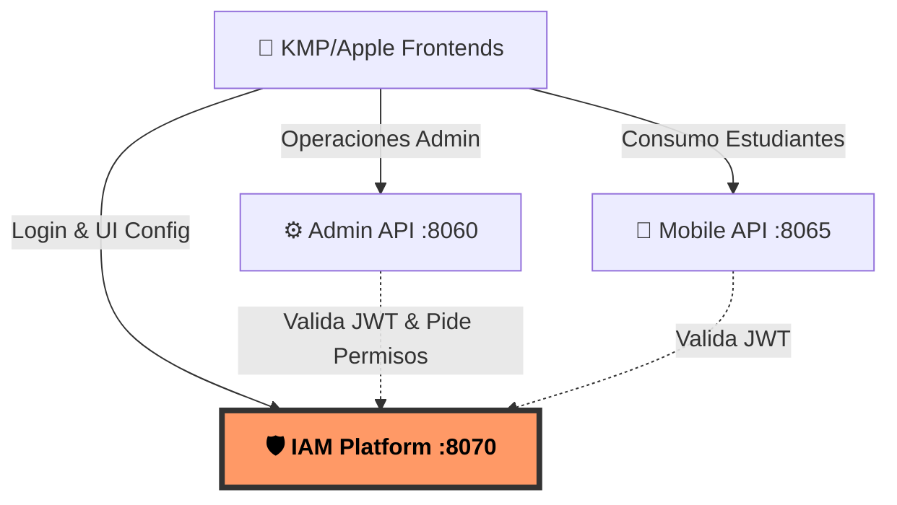

# 🌍 Integración en el Ecosistema EduGo

Si EduGo fuera un sistema solar, **edugo-api-iam-platform** sería el Sol. Este documento despliega cómo la API interactúa de forma agresiva y eficiente con el resto del ecosistema, siguiendo las leyes físicas definidas en `ecosistema.md`.

## 1. 👑 El Rol Supremo de IAM Platform

Escuchando en el puerto `8070`, la **API edugo-api-iam-platform** es el microservicio alfa para Autenticación, Autorización y Configuración de Interfaz de Usuario.

Absolutamente **todo** pasa por aquí. Los frontends vienen aquí a probar quiénes son; si tienen éxito, reciben un token JWT sellado criptográficamente. A partir de ese momento, el resto de los microservicios confían ciegamente en ese token. IAM dicta quién puede hacer qué.

## 2. 🕸️ La Red de APIs: Quién Depende de Quién

En la cadena alimenticia de las APIs de EduGo, la IAM Platform es la base inamovible, tanto en el caos del modo debug local como en el rigor de Producción:

**🔥 Puntos de Fricción Cero:**
- **Admin API (8060)**: No confía en nadie, le pregunta a IAM. Depende de la validación del JWT y hereda la gestión de roles que IAM dictamina para las entidades escolares.
- **Mobile API (8065)**: Tráfico masivo, pero la seguridad se delega en las firmas JWT que expidió IAM.
- **Frontends (KMP/Apple)**: iOS, Android, o WebAssembly... todos apuntan su `iamApiBaseUrl` directo a este núcleo.

## 3. 💾 Infraestructura: Pura y Dura

Esta API no se complica con infraestructuras difusas; es de un solo foco:
- **Corazón Relacional**: IAM Platform respira única y exclusivamente a través de **PostgreSQL**.
- **Independencia**: Cero acoplamiento con MongoDB o RabbitMQ (le dejamos ese ruido a la Mobile API y los workers).
- **Músculo en la Nube**: Conexión nativa a **Neon PostgreSQL** en Cloud (Staging/Prod) a través de `.zed/debug.json` para volar en local.
- **Dueña de su Dominio**: Reina sobre el esquema `auth` (`users`, `roles`, `permissions`, `refresh_tokens`).

## 4. 🧬 ADN Compartido: `edugo-shared`

IAM Platform no reinventa la rueda; exprime el paquete **edugo-shared** (Go Workspace). Inyecta esteroides a su código usando los siguientes subsistemas:
- 🔐 `auth`: Hashing implacable y criptografía JWT.
- 🏷️ `common`: Enums inmutables (`Role`, `Permission`) y tipos de hierro (`UUID`).
- 🛠️ `config`: Viper inyectando variables de entorno cual adrenalina.
- 🗄️ `database/postgres`: Los cimientos de acceso de GORM.
- 📝 `logger`: Zap estructurado, escupiendo logs a la velocidad de la luz.
- 🚧 `middleware/gin`: El escudo base antibalas compartido con el resto de APIs.
- 📱 `screenconfig`: Los contratos para la magia del UI Dinámico.

> ⚠️ **REGLA DE ORO**: Si necesitas alterar el tejido del espacio-tiempo (ej. un nuevo permiso global), debes hackear `edugo-shared` primero, hacer un Release glorioso en GitHub, y luego traerlo acá. (Excepto si estás en local abusando de la magia de `go.work`).

## 5. 🛠️ Invariantes para el Desarrollador (Modo Local)
- Tu mejor amigo local es el Workspace de Go: `/Users/jhoanmedina/source/EduGo/EduBack/go.work`.
- **PROHIBIDO EL GATILLO FÁCIL**: Modificar tablas con la consola SQL en la DB está estrictamente vetado. Los esquemas cambian en **edugo-infrastructure** (script de migración) y se aplican regenerando todo con **edugo-dev-environment** (`migrator/`). ¡Nada de `ALTER TABLE` a lo cowboy en este código!
