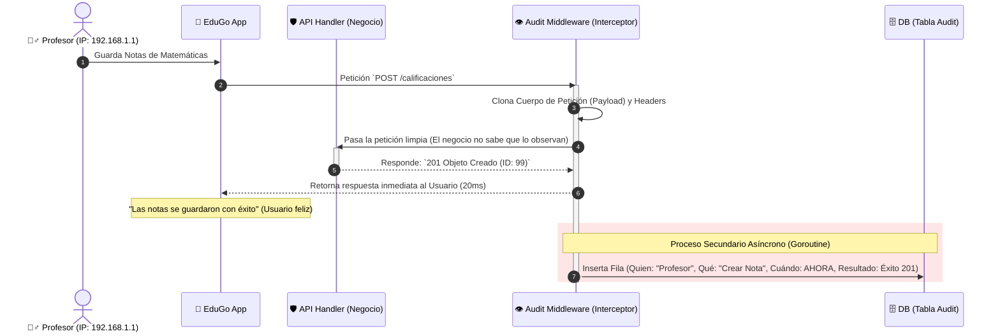
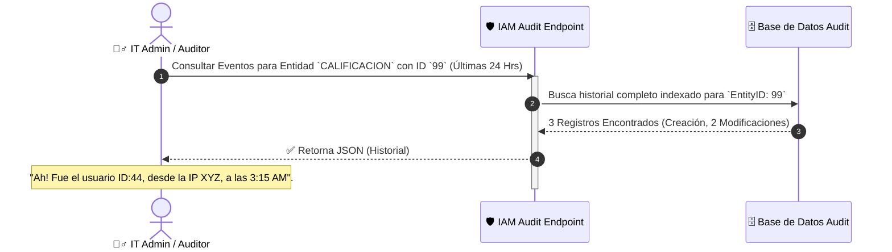

# 👁️ Trazabilidad y Seguridad (La Bitácora Negra | Audit)

**Responsabilidad principal:** Ser el Historiador Absoluto, silencioso e incorruptible de EduGo. Cada pulsación en cualquier pantalla regulada, en cualquier parte del mundo, es registrada aquí. 

Su genialidad radica en ser **asíncrono**: vigila y anota sin ralentizar las operaciones críticas del sistema. El usuario ni se entera de que cada "Clic en Guardar" quedó sellado con la IP, Fecha y los datos exactos que alteró.

---

## 📸 El Ojo Observador: Registro de Evento Asíncrono

El usuario hace su trabajo, la API se lo permite (o se lo deniega) y la Bitácora guarda una copia exacta del suceso sin estorbar el flujo TCP/HTTP original.

## 🔍 Consulta Forense: Auditoría Estricta

Ocurre cuando un Director de Escuela quiere saber "Quién rayos borró la nota del alumno de 1er Grado".

