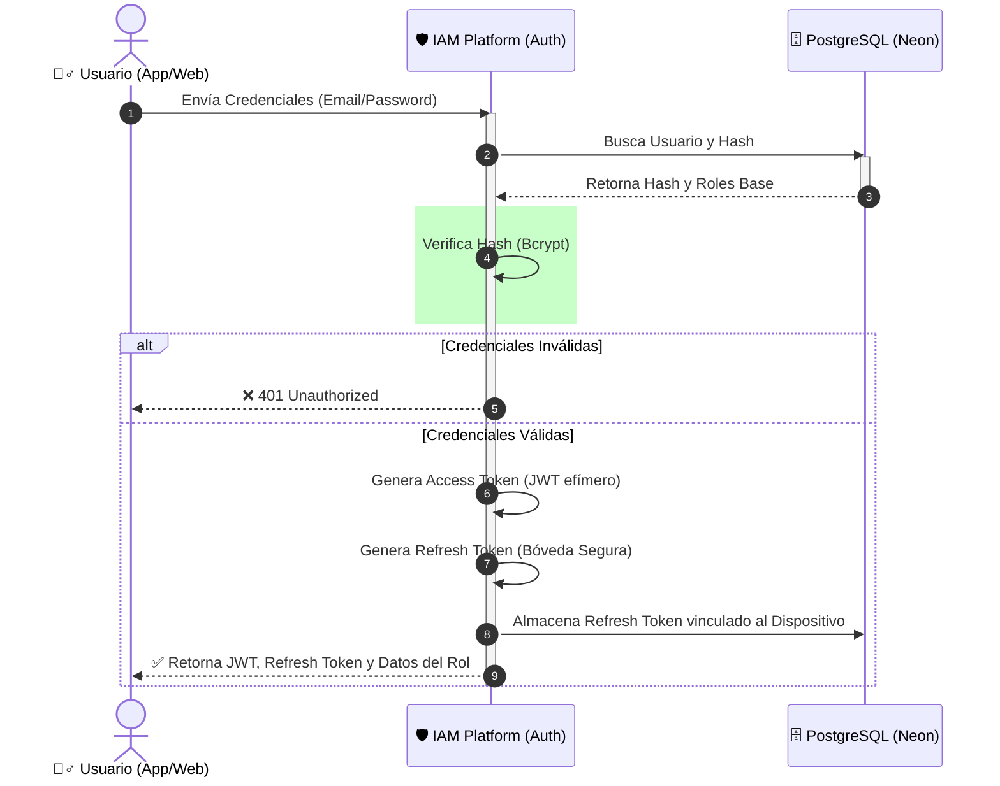
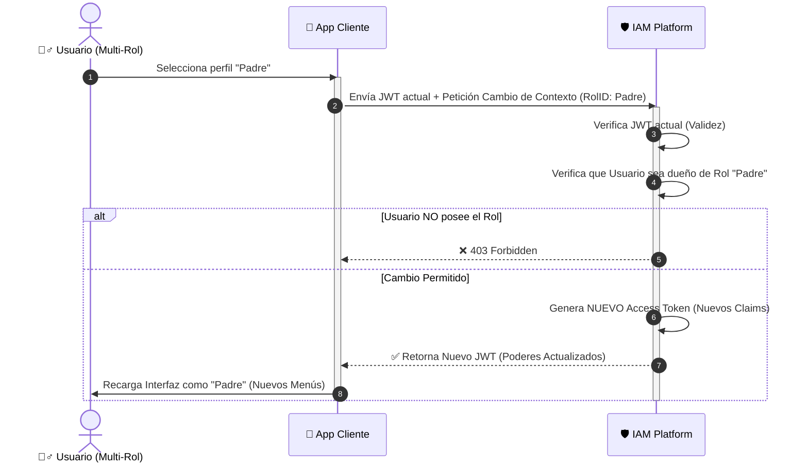
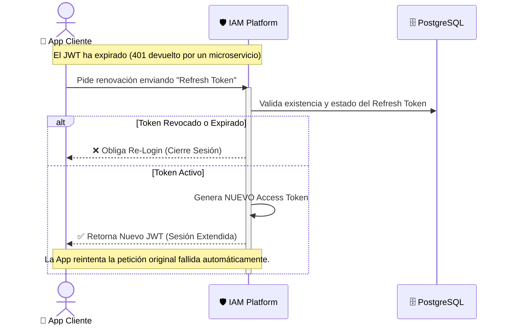

# 🛡️ Identidad y Sesiones (El Guardián)

**Responsabilidad principal:** Cuidar la puerta y mantener vivas las sesiones legítimas. IAM Platform no solo verifica quién es el usuario, sino que gestiona dinámicamente cómo y cuándo el usuario interactúa con los distintos perfiles (roles) que posee dentro del ecosistema EduGo.

## 🔄 Flujo Core: Login y Emisión de Tokens

El ritual de ingreso evalúa la identidad del usuario y emite credenciales temporales efímeras de alta seguridad (Access Token / JWT) junto con llaves para alargar la sesión sin intervención humana (Refresh Token).

## 🎭 La Magia del "Avatar" (Cambio de Contexto)

Una de las joyas del negocio en EduGo. Si eres **Director** de secundaria, pero tienes un hijo en la misma escuela (perfil **Padre**), el sistema te permite alternar tu nivel de poder y vistas en caliente, sin cerrar sesión ni introducir contraseñas de nuevo.

## 🔋 Mantenimiento del Pulso (Refresh Token)

Monitoreo silencioso. Cuando el "Boleto de Acceso" caduca, la aplicación cliente negocia un nuevo boleto detrás de escena usando el pase vitalicio.

