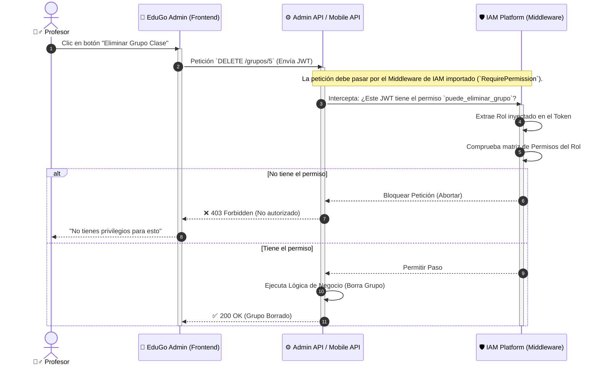
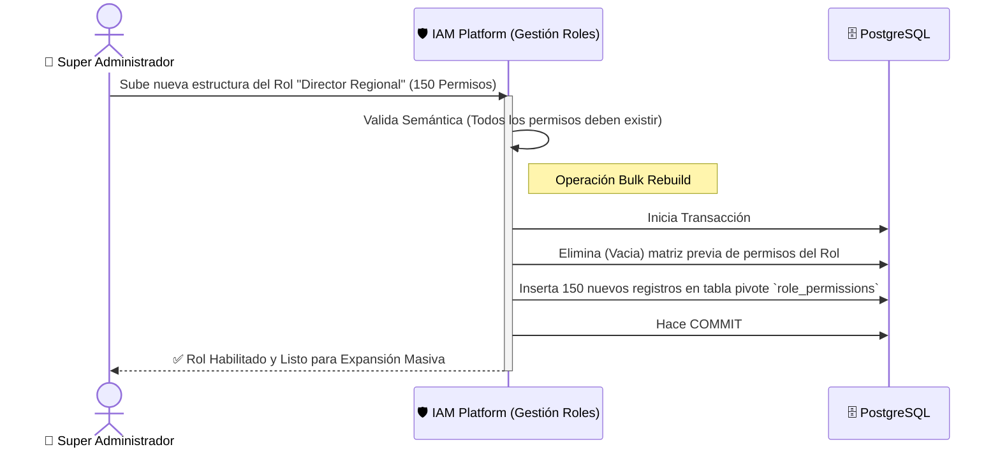

# 🎭 Roles y Privilegios (El Juez de Acceso)

**Responsabilidad principal:** Dictaminar qué acciones te están permitidas dentro del sistema EduGo, y rechazar sin piedad aquello para lo que no tienes competencia legal. Funciona como un escudo hipermodularizado frente a los otros microservicios de la cadena (Admin API, Mobile API).

## 🧩 Concepción: Roles vs Permisos

- **Rol:** Es solo un contenedor vacío, una máscara amigable. *Ej: "Coordinador Académico"*.
- **Permiso:** Es el átomo de la seguridad. Representa el derecho a ejecutar un verbo sobre un módulo. *Ej: `puede_crear_usuarios`, `puede_ver_reportes_financieros`*.

IAM Platform rompe la rigidez clásica. Un rol puede mutar: si a mitad de año un colegio decide que los Coordinadores ahora pueden expulsar alumnos, IAM simplemente adhiere el permiso `puede_expulsar_estudiantes` al rol "Coordinador", y automáticamente todos los coordinadores del continente heredan el poder.

## 🚦 Flujo Corto: Evaluación de Permisos Restrictiva

Cuando un usuario intenta hacer algo serio, el Juez de Acceso evalúa la legalidad de la acción de forma casi imperceptible gracias a la inyección de claims.

## 🛠️ Flujo Administrativo: Forja Mágica de Roles (Asignación en Lote)

Las secretarías de educación no crean permisos de uno por uno; compran "Combos" (Bulks) que definen drásticamente la estructura de poder de toda la institución.

