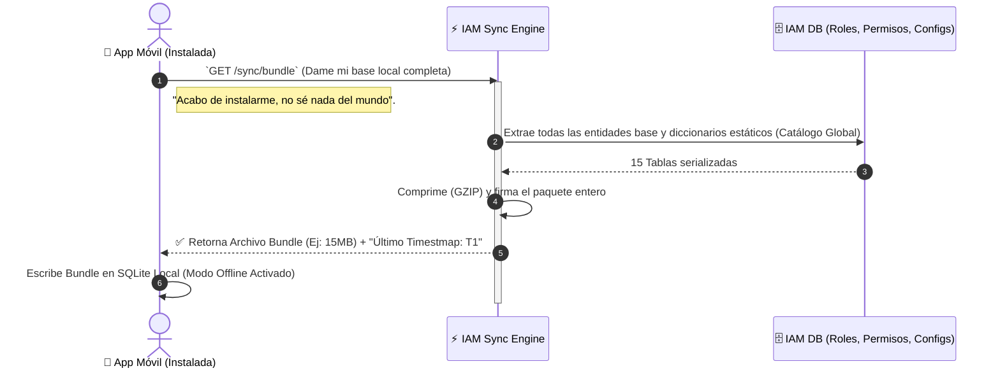
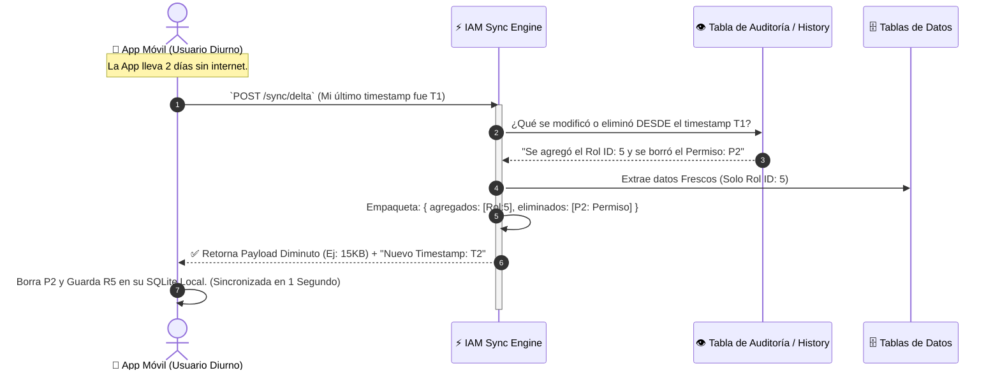

# ⚡ Motor de Sincronía (El Oxigenador Móvil)

**Responsabilidad principal:** Sincronizar el estado del mundo entre el servidor en la nube y los miles de dispositivos móviles o clientes web distribuidos por todo el ecosistema EduGo. Asegura que los dispositivos puedan sobrevivir y ser útiles en modo "Offline" (sin internet) al recargas sus bases de datos SQLite locales de forma ultra-eficiente.

El proceso es quirúrgico: no descargamos un giga de datos todos los días; descargamos un paquete maestro inicial (Bundle) y luego solo lo que cambió ayer (Deltas).

---

## 📦 Extracción Total: El Paquete Maestro (Bundle)

Ocurre cuando el usuario instala la app por primera vez o borra la caché. Es una descarga pesada inicial con la configuración del universo EduGo.

## 💉 Inyección Quirúrgica: Delta Sync (Lo que cambió)

Es el pan de cada día. La app despierta, mira el reloj, y pide al servidor que le envíe únicamente los pedacitos de datos que mutaron desde la última vez que hablaron.

