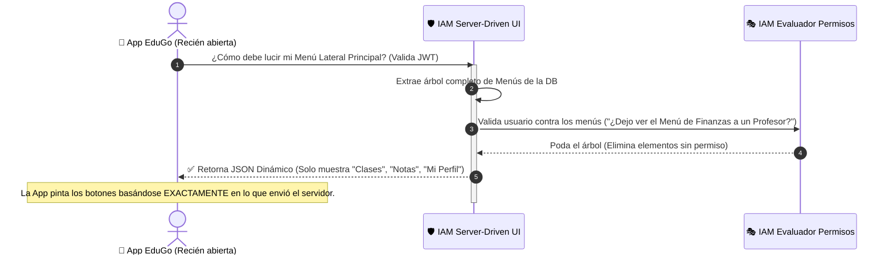
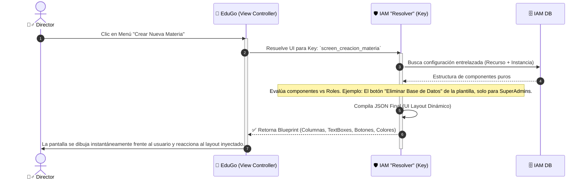

# 🎨 Server-Driven UI (El Titiritero de la Experiencia)

**Responsabilidad principal:** Enviar interfaces en código, no solo datos aburridos. Las aplicaciones (KMP, SwiftUI) no saben cómo lucir por defecto; es **IAM Platform** quien analiza la mente del usuario (sus poderes y permisos) y despliega la fachada visual exacta que ese usuario debe observar.

De adentro hacia afuera: dictamos *qué menús* ves, *qué campos de formulario* rellenas y *dónde das clic*, eliminando la tortura de someter la app a revisión por Apple y Google cada semana.

## 🧬 Anatomía Rápida del Titiritero:
1. **Recurs0 (`Resource`)**: La entidad conceptual del negocio (Ej. "Módulo Pagos").
2. **Plantilla (`Template`)**: El esqueleto de interfaz (Ej. "Formulario de 2 Columnas").
3. **Instancia (`Instance`)**: La fusión ("Módulo Pagos" dibujado sobre "Formulario 2 Columnas" con configuraciones de botones para "Pagar" y "Cancelar").

---

## 🗺️ Menú Camaleónico: Resolución al Vuelo

El primer saludo entre la App Móvil/Web y el Servidor IAM.

## 🏗️ Renderizado Telepático: El "Resolver"

No es solo el menú; también es **cómo** se ven las pantallas por dentro. Así es como la App sabe pintar un formulario gigantesco si tú eres Admin o uno diminuto si eres estudiante.

